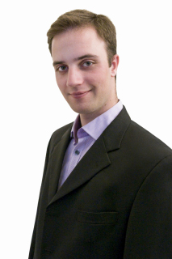

% Ph. D. Student, Computer Science, UC Berkeley
% Timothy J. Hunter
% 2012-12-20

<a href="img/me-full.jpg"></a>


About
--------

I am a Ph. D. student in Artifical Intelligence, in the 
Department of Computer Science at the
University of California at Berkeley.

My advisors are [Pieter Abbeel](http://www.cs.berkeley.edu/%7Epabbeel/) and [Alexandre Bayen](http://lagrange.ce.berkeley.edu/bayen/).


Degrees:

+   M.Sc. Electrical Engineering,\
      Stanford University, 2008
+   Eng. Deg., Applied Math.\
      Ecole Polytechnique, France, 2004

**Research interests:**

*    Artificial intelligence
       - Bayesian inference on large scale systems
       - Reinforcement learning
*    Distribution software engineering
       - Optmization
       - Cloud-based machine learning
*    Privacy and security in cyberphysical systems
       - Information sharing
       - Transportation in intelligent infrastructure systems


--------------------------------


Contact
=========

**E Mail:**
tjhunter@eecs.berkeley.edu

**Address:**

    Timothy Hunter
    University of California, Berkeley
    710 Sutardja Dai Hall
    Berkeley, CA 94720-1720


**Social networks:**
I am also on [LinkedIn](http://www.linkedin.com/in/timotheehunter) and [Viadeo](http://www.viadeo.com/en/profile/timothee.hunter).

**CV:** [PDF](publications/cv.pdf) [Shorter version](publications/resume.pdf)

--------------------------------


Research
=========

I work on the *Mobile Millennium* project, and its successor, the *Integrated Corridor Management* (ICM) project.
The Mobile Millennium project aims to develop methodologies 
and algorithms in traffic estimation, traffic forecast and real-time routing. It is a joint effort 
between UC Berkeley, the California Department of Transportation, Navteq and Nokia.

In this context I am interested in efficient statistical methods for estimating traffic. 
In particular, I work on correctly mapping probe data to the road network, and on distributed 
algorthims using cloud computing. This is a joint research project with the [AMPLab at UC Berkeley](http://amplab.cs.berkeley.edu/).

Here are a few projects I have been working on.

Path inference
---------------

The *Path Inference Filter* (PIF) is a novel algorithm to map-match GPS trajectories on a road network.
It works on GPS data sampled at high frequencies (1Hz) or low frequencies (up to 2 minute intervals)
and can be adapted to a variety of scenarios (offline smoothing, online filtering, etc.). 
We use it in the *Mobile Millennium* project
to map several millions of GPS points from various sources on a daily basis.
We provide an implementation in Scala/Java that can map several thousands points per second on a road network
comprising 2 millions road elements with high accuracy (the San Francisco Bay Area).

A nearly industrial-grade implementation (Scala) is available at [https://github.com/calpath/open-traffic](https://github.com/calpath/open-traffic)

A more academic (slower) implementation in Python is available at [https://github.com/tjhunter/Path-Inference-Filter](https://github.com/tjhunter/Path-Inference-Filter)

More code, videos, examples are available [here](pif.html).

Large scale estimation
-----------------------

*(Joint work with Matei Zaharia and Tathagata Das)* We investigated solving traffic estimation at a
very large scale using the [**Spark** computing framework](http://spark-project.org). We implemented an 
EM algorithm that can update traffic estimates in less than 5 seconds from a GPS stream with a rate of tens of thousands
of observations per second (using a cluster of 80 machines).

See references [@hunter11socc] and [@hunter12tase].

The source code (Scala) is available at [http://github.com/tjhunter/](http://github.com/tjhunter/)
*Requires Spark 0.7, which will be released soon*.


Understanding urban patterns
------------------------------

*(Collaboration with Pu Wang and Marta González)*.

See [@wang].


--------------------------------


Publications
=============

Journals
---------

(@hunter12tase) Timothy Hunter, Tathagata Das, Matei Zaharia, Pieter Abbeel, Alexandre M. Bayen.
**Large Scale Estimation in Cyberphysical Systems using Streaming Data: a Case Study with Smartphone Traces**.
Under review for the *IEEE Transactions on Automation Science and Engineering*.
[Arxiv](http://arxiv.org/abs/1212.3393)

(@hunter12tits) Timothy Hunter, Pieter Abbeel, Alexandre M. Bayen.
**The Path Inference Filter: Model-Based Low-Latency Map Matching of Probe Vehicle Data**.
To appear in the *IEEE Transactions on Intelligent Transportation Systems*.
[Arxiv](http://arxiv.org/abs/1109.1966)


(@wang) Pu Wang, Timothy Hunter, Alexandre M. Bayen, Katja Schechtner, Marta C. González.
**Understanding Road Usage Patterns in Urban Areas**.
In *Nature Scientific Reports*.
[PDF](http://www.nature.com/srep/2012/121220/srep01001/pdf/srep01001.pdf)
[DOI](http://dx.doi.org/10.1038/srep01001)


Conferences
------------


(@hunter11socc) Timothy Hunter, Teodor Moldovan, Matei Zaharia, Samy Merzgui, 
Justin Ma, Michael J. Franklin, Pieter Abbeel, and Alexandre M. Bayen.
**Scaling the mobile millennium system in the cloud**. In *Proceedings of the 2nd ACM Symposium on Cloud Computing* (SOCC), 2011.
ACM, New York, NY, USA, , Article 28 , 8 pages.
[DOI](http://doi.acm.org/10.1145/2038916.2038944)
[PDF](publications/hunter11socc.pdf)
<a href="#" class="showbibtex">BIBTex</a>
<a href="#" class="hidebibtex">Hide BIBTex</a>

    ```bibtex
    @inproceedings{Hunter:2011:SMM:2038916.2038944,
      author = {Hunter, Timothy and Moldovan, Teodor and Zaharia, Matei and Merzgui, Samy and Ma, Justin and Franklin, Michael J. and Abbeel, Pieter and Bayen, Alexandre M.},
      title = {Scaling the mobile millennium system in the cloud},
      booktitle = {Proceedings of the 2nd ACM Symposium on Cloud Computing},
      series = {SOCC '11},
      year = {2011},
      isbn = {978-1-4503-0976-9},
      location = {Cascais, Portugal},
      pages = {28:1--28:8},
      articleno = {28},
      numpages = {8},
      url = {http://doi.acm.org/10.1145/2038916.2038944},
      doi = {10.1145/2038916.2038944},
      acmid = {2038944},
      publisher = {ACM},
      address = {New York, NY, USA},
    } 
    ```

(@hunter12wafr) Timothy Hunter, Pieter Abbeel, Alexandre M. Bayen.
**The Path Inference Filter: Model-Based Low-Latency Map Matching of Probe Vehicle Data**.
In the *10th International Workshop on the Algorithmic Foundations of Robotics* (WAFR), 2012.
[DOI](http://dx.doi.org/10.1007/978-3-642-36279-8_36)
[PDF](publications/hunter12wafr.pdf)
<a href="#" class="showbibtex">BIBTex</a>
<a href="#" class="hidebibtex">Hide BIBTex</a>

    ```bibtex
    @inproceedings{hunter12wafr,
      author = {Hunter, Timothy and Abbeel, Pieter and Bayen, Alexandre M.},
      title = {The Path Inference Filter: Model-Based Low-Latency Map Matching of Probe Vehicle Data},
      booktitle = {Algorithmic Foundations of Robotics X},
      series = {Springer Tracts in Advanced Robotics},
      year = {2012},
      isbn = {978-3-642-36278-1},
      location = {Cambridge, MA, USA},
      pages = {591:1--607:17},
      articleno = {28},
      numpages = {17},
      url = {http://doi.acm.org/10.1145/2038916.2038944},
      doi = {10.1007/978-3-642-36279-8_36},
      publisher = {Springer-Verlag},
      address = {Heidelberg, Germany},
    } 
    ```


Workshops, technical reports
-----------------------------


(@hunter09) Timothy Hunter, Ryan Herring, Pieter Abbeel and Alex Bayen. 
**Path and travel time inference from GPS probe vehicle data**.
At *NIPS Analyzing Networks and Learning with Graphs*, 2009.
[PDF](publications/hunter09nipsworkshop.pdf)

(@hunter11nips) Timothy Hunter, Matei Zaharia, Tathagata Das, Pieter Abbeel and Alexandre Bayen. 
**Large-Scale Online Expectation Maximization with Spark Streaming**.
At *NIPS workshop on parallel and large-scale machine learning*, 2012.
[PDF](publications/hunter12biglearning.pdf)

(@zaharia12) Matei Zaharia, Tathagata Das, Haoyuan Li, Timothy Hunter, Scott Shenker, Ion Stoica.
**Discretized Streams: A Fault-Tolerant Model for Scalable Stream Processing**.
Technical Report No. UCB/EECS-2012-259.
[PDF](http://www.eecs.berkeley.edu/Pubs/TechRpts/2012/EECS-2012-259.pdf)
<a href="#" class="showbibtex">BIBTex</a>
<a href="#" class="hidebibtex">Hide BIBTex</a>

    ```bibtex
    @techreport{Zaharia:EECS-2012-259,
    Author = {Zaharia, Matei and Das, Tathagata and Li, Haoyuan and Hunter, Timothy and Shenker, Scott and Stoica, Ion},
    Title = {Discretized Streams: A Fault-Tolerant Model for Scalable Stream Processing},
    Institution = {EECS Department, University of California, Berkeley},
    Year = {2012},
    Month = {Dec},
    URL = {http://www.eecs.berkeley.edu/Pubs/TechRpts/2012/EECS-2012-259.html},
    Number = {UCB/EECS-2012-259}
    }
    ```

Talks
------

**Large scale sensing and prediction**,
Alex Bayen and Timothy Hunter.\
Keynote speech at the AMPLab retreat, October 2010.

**Spark User Applications - Mobile Millennium**.  
Tutorial for the [AMPLab Bootcamp](http://ampcamp.berkeley.edu/).\
[Youtube](http://youtu.be/CLyQvsQpg4I)

Older publications
-------------------

(@abbeel2009)  Pieter Abbeel, Adam Coates, Timothy Hunter and Andrew Y. Ng 
2009
**Autonomous Autorotation of an RC Helicopter**
In *Experimental Robotics*
[DOI](http://dx.doi.org/10.1007/978-3-642-00196-3_45)
[PDF](publications/abbeel2009.pdf)
<a href="#" class="showbibtex">BIBTex</a>
<a href="#" class="hidebibtex">Hide BIBTex</a>

    ```bibtex
    @incollection{,
    year={2009},
    isbn={978-3-642-00195-6},
    booktitle={Experimental Robotics},
    volume={54},
    series={Springer Tracts in Advanced Robotics},
    editor={Khatib, Oussama and Kumar, Vijay and Pappas, GeorgeJ.},
    doi={10.1007/978-3-642-00196-3_45},
    title={Autonomous Autorotation of an RC Helicopter},
    url={http://dx.doi.org/10.1007/978-3-642-00196-3_45},
    publisher={Springer Berlin Heidelberg},
    author={Abbeel, Pieter and Coates, Adam and Hunter, Timothy and Ng, AndrewY.},
    pages={385-394}
    }
    ```


--------------------------------

Trivia
======

In the few spare times academia leaves me, I enjoy discovering and taking pictures
of new places. You can see a few samples on my [Picasa page](http://picasaweb.google.com/timothee.hunter).

Some say that I used to play magic tricks when I was in high school, 
according to this [Wikipedia entry](http://en.wikipedia.org/wiki/Timothy_Hunter).

This web page was created using [Pandoc](http://johnmacfarlane.net/pandoc/) and styled with [Bootstrap](http://twitter.github.com/bootstrap/),
based on the excellent template from [Jack Reilly](https://github.com/jackdreilly/jackdreilly.github.com).
The CSS theme was autogenerated using [Lavish](http://www.lavishbootstrap.com/).
The source code for this page is available [here](https://github.com/tjhunter/tjhunter.github.com).


